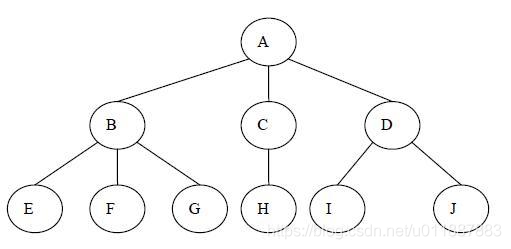

### 访问控制

该目录提供了限制谁可以访问合约功能或何时可以访问的方法。

\- {AccessControl} 提供了一个通用的基于角色的访问控制机制。可以创建多个分层角色并将每个角色分配给多个帐户。

AccessControl.sol 角色管理，1对1

AccessControlEnumerable.sol 角色管理，1对多

#### AccessControl.sol

AccessControl 支持多级控制。AccessControl 的核心是角色，每个角色都是一个bytes32的数字。

- 每个角色都可以添加地址为自己的会员，可以根据会员的地址判断此会员是否属于某角色，角色下面的会员可以遍历，会员是地址可以为合约或者钱包账户。
- 会员可以自己退出某个角色，不用经过管理员。
- 角色的管理员是adminRole下面的会员
- 角色的管理员可以将给角色添加会员，或者移除某会员
- 一般用_setupRole方法初始化根角色（超级管理员），为了合约的安全性最好只在构造方法中调用一次
- AccessControl 合约是一颗很明显的树，不过只支持从叶子向根进行寻址，无法进行遍历。只允许父级控制不允许管理员越级控制。




在上图的角色中 E,F,G 的管理员角色是B ；H的管理员角色是C ；I，J的管理员角色是D；B，C，D的管理员角色是A
则A可以控制B,C,D的会员增减，B可以控制E，F，G的会员增减，但是A无法控制E，F，G的会员。

```
// SPDX-License-Identifier: MIT
// OpenZeppelin Contracts (last updated v4.7.0) (access/AccessControl.sol)

pragma solidity ^0.8.0;

import "./IAccessControl.sol";
import "../utils/Context.sol";
import "../utils/Strings.sol";
import "../utils/introspection/ERC165.sol";

/**
 * @dev Contract module that allows children to implement role-based access
 * control mechanisms. This is a lightweight version that doesn't allow enumerating role
 * members except through off-chain means by accessing the contract event logs. Some
 * applications may benefit from on-chain enumerability, for those cases see
 * {AccessControlEnumerable}.
 *
 * Roles are referred to by their `bytes32` identifier. These should be exposed
 * in the external API and be unique. The best way to achieve this is by
 * using `public constant` hash digests:
 *
 * ```
 * bytes32 public constant MY_ROLE = keccak256("MY_ROLE");
 * ```
 *
 * Roles can be used to represent a set of permissions. To restrict access to a
 * function call, use {hasRole}:
 *
 * ```
 * function foo() public {
 *     require(hasRole(MY_ROLE, msg.sender));
 *     ...
 * }
 * ```
 *
 * Roles can be granted and revoked dynamically via the {grantRole} and
 * {revokeRole} functions. Each role has an associated admin role, and only
 * accounts that have a role's admin role can call {grantRole} and {revokeRole}.
 *
 * By default, the admin role for all roles is `DEFAULT_ADMIN_ROLE`, which means
 * that only accounts with this role will be able to grant or revoke other
 * roles. More complex role relationships can be created by using
 * {_setRoleAdmin}.
 *
 * WARNING: The `DEFAULT_ADMIN_ROLE` is also its own admin: it has permission to
 * grant and revoke this role. Extra precautions should be taken to secure
 * accounts that have been granted it.
 */
abstract contract AccessControl is Context, IAccessControl, ERC165 {
    struct RoleData {
        mapping(address => bool) members;
        bytes32 adminRole;
    }

    mapping(bytes32 => RoleData) private _roles;

    bytes32 public constant DEFAULT_ADMIN_ROLE = 0x00;

    /**
     * @dev 检查帐户是否具有特定角色的修饰符。使用包含所需角色的标准化消息进行还原
     *
     * The format of the revert reason is given by the following regular expression:
     *
     *  /^AccessControl: account (0x[0-9a-f]{40}) is missing role (0x[0-9a-f]{64})$/
     *
     * _Available since v4.1._
     */
    modifier onlyRole(bytes32 role) {
        _checkRole(role);
        _;
    }

    /**
     * @dev See {IERC165-supportsInterface}.
     */
    function supportsInterface(bytes4 interfaceId) public view virtual override returns (bool) {
        return interfaceId == type(IAccessControl).interfaceId || super.supportsInterface(interfaceId);
    }

    /**
     * @dev Returns `true` if `account` has been granted `role`.
     */
    function hasRole(bytes32 role, address account) public view virtual override returns (bool) {
        return _roles[role].members[account];
    }

    /**
     * @dev Revert with a standard message if `_msgSender()` is missing `role`.
     * Overriding this function changes the behavior of the {onlyRole} modifier.
     *
     * Format of the revert message is described in {_checkRole}.
     *
     * _Available since v4.6._
     */
    function _checkRole(bytes32 role) internal view virtual {
        _checkRole(role, _msgSender());
    }

    /**
     * @dev Revert with a standard message if `account` is missing `role`.
     *
     * The format of the revert reason is given by the following regular expression:
     *
     *  /^AccessControl: account (0x[0-9a-f]{40}) is missing role (0x[0-9a-f]{64})$/
     */
    function _checkRole(bytes32 role, address account) internal view virtual {
        if (!hasRole(role, account)) {
            revert(
                string(
                    abi.encodePacked(
                        "AccessControl: account ",
                        Strings.toHexString(uint160(account), 20),
                        " is missing role ",
                        Strings.toHexString(uint256(role), 32)
                    )
                )
            );
        }
    }

    /**
     * @dev Returns the admin role that controls `role`. See {grantRole} and
     * {revokeRole}.
     *
     * To change a role's admin, use {_setRoleAdmin}.
     */
    function getRoleAdmin(bytes32 role) public view virtual override returns (bytes32) {
        return _roles[role].adminRole;
    }

    /**
     * @dev Grants `role` to `account`.
     *
     * If `account` had not been already granted `role`, emits a {RoleGranted}
     * event.
     *
     * Requirements:
     *
     * - the caller must have ``role``'s admin role.
     *
     * May emit a {RoleGranted} event.
     */
    function grantRole(bytes32 role, address account) public virtual override onlyRole(getRoleAdmin(role)) {
        _grantRole(role, account);
    }

    /**
     * @dev Revokes `role` from `account`.
     *
     * If `account` had been granted `role`, emits a {RoleRevoked} event.
     *
     * Requirements:
     *
     * - the caller must have ``role``'s admin role.
     *
     * May emit a {RoleRevoked} event.
     */
    function revokeRole(bytes32 role, address account) public virtual override onlyRole(getRoleAdmin(role)) {
        _revokeRole(role, account);
    }

    /**
     * @dev Revokes `role` from the calling account.
     *
     * Roles are often managed via {grantRole} and {revokeRole}: this function's
     * purpose is to provide a mechanism for accounts to lose their privileges
     * if they are compromised (such as when a trusted device is misplaced).
     *
     * If the calling account had been revoked `role`, emits a {RoleRevoked}
     * event.
     *
     * Requirements:
     *
     * - the caller must be `account`.
     *
     * May emit a {RoleRevoked} event.
     */
    function renounceRole(bytes32 role, address account) public virtual override {
        require(account == _msgSender(), "AccessControl: can only renounce roles for self");

        _revokeRole(role, account);
    }

    /**
     * @dev Grants `role` to `account`.
     *
     * If `account` had not been already granted `role`, emits a {RoleGranted}
     * event. Note that unlike {grantRole}, this function doesn't perform any
     * checks on the calling account.
     *
     * May emit a {RoleGranted} event.
     *
     * [WARNING]
     * ====
     * This function should only be called from the constructor when setting
     * up the initial roles for the system.
     *
     * Using this function in any other way is effectively circumventing the admin
     * system imposed by {AccessControl}.
     * ====
     *
     * NOTE: This function is deprecated in favor of {_grantRole}.
     */
    function _setupRole(bytes32 role, address account) internal virtual {
        _grantRole(role, account);
    }

    /**
     * @dev Sets `adminRole` as ``role``'s admin role.
     *
     * Emits a {RoleAdminChanged} event.
     */
    function _setRoleAdmin(bytes32 role, bytes32 adminRole) internal virtual {
        bytes32 previousAdminRole = getRoleAdmin(role);
        _roles[role].adminRole = adminRole;
        emit RoleAdminChanged(role, previousAdminRole, adminRole);
    }

    /**
     * @dev Grants `role` to `account`.
     *
     * Internal function without access restriction.
     *
     * May emit a {RoleGranted} event.
     */
    function _grantRole(bytes32 role, address account) internal virtual {
        if (!hasRole(role, account)) {
            _roles[role].members[account] = true;
            emit RoleGranted(role, account, _msgSender());
        }
    }

    /**
     * @dev Revokes `role` from `account`.
     *
     * Internal function without access restriction.
     *
     * May emit a {RoleRevoked} event.
     */
    function _revokeRole(bytes32 role, address account) internal virtual {
        if (hasRole(role, account)) {
            _roles[role].members[account] = false;
            emit RoleRevoked(role, account, _msgSender());
        }
    }
}
```


